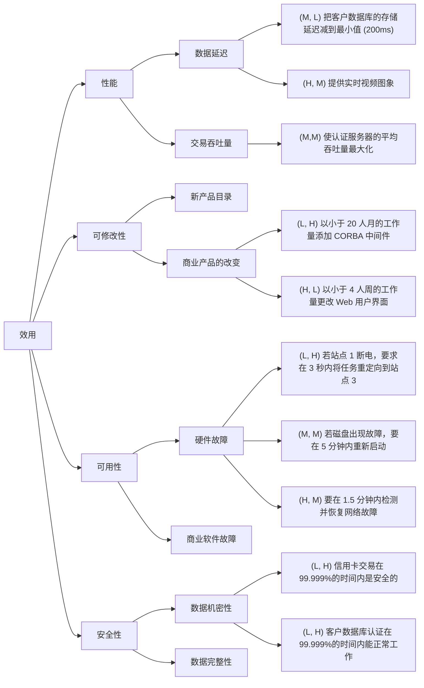

# SAreview (2023.2.20)

```toc
max_depth: 3
```

<div style="page-break-after: always" > </div>

## Unit1 概述

### 软件架构产生的背景

> [!tip]
> 软件危机促使大家了解软件架构的重要性，它对软件质量的重要作用。
> 软件架构能起到什么作用？所以在解决问题的过程中，软件架构越来越被重视。

#### 软件危机

20 世纪 60-90 年代软件生产效率低下，软件产品质量差。软件开发理论不够系统、技术手段相对滞后，手工作坊式生产。

20 世纪 90 年代后随软件规模的进一步扩大和软件复杂性的不断提高，新一轮软件危机再次出现。

**危机根源：**

1. 软件复杂、易变，其行为特性难以预见，软件开发过程中需求和设计之间缺乏有效的转换，导致软件开发过程的困难和不可控；
2. 随着软件系统规模越来越大、越来越复杂，整个系统的结构和规格说明显得越来越重要；
3. 对于大规模的复杂软件系统，比起对计算算法和数据结构的选择，总体的系统结构设计和规格说明明显重要得多；
4. 对软件系统结构的深入研究将会成为提高软件生产率和解决软件维护问题的最有希望的新途径。

#### 软件架构的作用

软件架构在高级层次上对软件进行描述，便于软件开发过程中各个视角（例如用户、业务和系统）的统一，能够及早发现开发中的问题并支持各种解决方案的评估和预测。其意义贯穿软件生命周期的各个阶段。

### 软件架构的思想和特征

#### 主要思想

软件架构是一个软件系统的设计图，并不局限于软件系统的总体结构，还包含一些质量属性以及功能与结构之间的映射关系，即设计决策。

软件架构的两个主要焦点集中于==系统的总体结构==以及==需求和实现之间的对应==。

**主要思想**：将注意力集中在系统总体结构的组织上。

**软件架构思想的实现：**

- 运用==抽象==方法屏蔽错综复杂的模块间连接，使人们的认知提升并保持在整体结构的部件“交互”层次；
- 进一步将交互从计算中分离出来，建立“==组件 + 连接件 + 配置==”的软件系统高层结构组织方式。

#### 软件架构的特征

| 特征           | 实现方式                                   | 作用                                     |
| :-----------: | :----------------------------------------- | :--------------------------------------- |
| 注重可重用性   | 组件及架构级重用                           | 提高软件质量                             |
| 利益相关者较多 | 满足各利益相关者需求                       | 平衡需求                                 |
| 关注点分离     | 分而治之、模块化                           | 简化复杂性                               |
| 质量驱动       | 使用软件架构来处理质量属性需求、控制复杂性 | 由功能、数据流驱动向质量驱动转变         |
| 概念完整性     | 强调设计决策是一个持续的过程               | 每个决策都要在其前面设计决策的基础上进行 |
| 循环风格       | 架构风格、架构模式                         | 用标准方法来处理反复出现的问题           |

### 软件架构的发展阶段，各阶段特征（了解）

> [!tip]
> 在各个阶段，硬件特征、软件需求是什么？为什么有这样的软件架构产生？（了解）

#### 无体系结构

高级语言出现

#### 基础研究阶段（1968-1994）

面向过程开发。开始模块化。

==模块化==：指的是一种软件开发方法，把一个待开发的软件分解成若干小的简单的部分，称为模块。每一个模块都独立地开发、测试，最后再组装出整个软件。

模块化规则：

1. 高内聚，低耦合
2. 模块大小适度
3. 模块调用链的深度 （嵌套层次） 不可过多
4. 接口干净，信息隐蔽
5. 尽可能地复用已有模块

#### 核心技术形成（1991-2000）

面向对象开发

1. 软件架构作为一个独立的研究领域出现。
2. 软件架构核心技术的发展。这一阶段最重要的成果之一就是==软件组件化技术==。
3. 软件组件技术。

#### 理论体系丰富（1996-1999）

面向服务开发

#### 理论体系完善及普及应用（1999- 至今）

云和移动服务、智能化软件开发

### 软件架构研究和应用现状（了解）

#### 软件架构理论和方法研究

##### 软件架构描述与构造表示

- 软件架构描述语言：各种 ADL
- 软件架构构造表示方法：
  - 形式化的架构描述方法：在严格的数学基础之上
  - Kruchten 的“4+1”架构模型：从 5 个不同的视角包括逻辑视角、过程视角、物理视角、开发视角和场景视角来描述软件架构。
  - 使用 UML 的架构描述方法
- IEEE 的软件架构描述规范（IEEE 1471-2000）

##### 软件架构分析、设计与测试

- ==软件架构分析的目的是在系统被实际构造之前，预测其质量属性。==
- 架构分析的内容可分为结构分析、功能分析和非功能分析。
- 软件架构分析常见方法如：基于场景的架构分析方法 SAAM、架构折中分析方法 ATAM 等

==软件架构的设计指生成一个满足软件需求的架构的过程。==

常见的软件架构的设计方法如

- 工件驱动（artifact-driven）方法
- 用例驱动（usecase-driven）方法
- 模式驱动（pattern-driven）方法
- 领域驱动（domain-driven）方法
- 属性驱动设计（attribute-driven design）方法等

==架构测试着重于仿真系统模型，解决架构层的主要问题。==

由于测试的抽象层次不同，架构测试策略可以分为单元、子系统、集成、验收测试等阶段的测试策略。

##### 软件架构发现、演化与复用

架构发现解决如何从已经存在的系统中提取软件的架构，属于逆向工程。

软件架构的演化指由于系统需求、技术、环境、分布等因素的变化而最终导致软件架构的变动。

架构重用属于设计重用，比代码重用更抽象。架构模式就是架构复用的一个研究成果。

##### 基于软件架构的开发模型

跨越整个软件生存周期的系统开发、运行、维护所实施的全部工作和任务的结构框架

##### 软件架构的风格与模式

架构风格（架构模式）是对给定场景中经常出现的问题提供的一般性的可重用方案

David Garlan 和 Mary Shaw 等人将被广泛接受的架构风格分成五种主要的类型：

1. 数据流风格：批处理序列；管道 - 过滤器
2. 调用/返回风格：主程序/子程序；面向对象风格；层次结构
3. 独立组件风格：进程通信；事件系统
4. 虚拟机风格：解释器；基于规则的系统
5. 仓库风格：数据库系统；超文本系统；黑板系统

##### 软件产品线架构

软件产品线表示着一组具有公共的系统需求集的软件系统，它们都是根据基本的用户需求对标准的产品线架构进行定制，将可重用组件与系统独有的部分集成而得到的。

软件产品线架构的发展是依托着特定领域软件架构（Domain Specific Software Architecture，DSSA）的研究深入而进行的。

##### 软件架构支持工具

- 支持静态分析的工具
- 支持类型检查的工具
- 支持架构层次依赖分析的工具
- 支持架构动态特性仿真的工具
- 支持架构性能仿真的工具等

#### 软件架构的应用研究

##### 软件架构风格的应用

人们在软件开发实践中总结出了许多软件架构风格。

架构风格（架构模式）是对给定场景中经常出现的问题提供的一般性的可重用方案，它反映了领域中众多系统所共有的结构和语义特性，并指导如何将各个模块和子系统有效的组织成一个完整的系统。

不同的架构风格具有各自的优缺点和应用场景。例如：

- 虚拟机风格经常用于构造解释器或专家系统；
- C/S 和 B/S 适合于数据和处理分布在一定范围、通过网络连接构成的系统；
- “平台 - 插件”风格适用于具有插件扩展功能的应用程序中；
- MVC 被广泛的应用于用户交互程序的设计；
- SOA 应用在企业集成等方面

##### 软件架构在开发过程中的应用

- **需求阶段**：把 SA 的概念引入到需求分析阶段，有助于保证需求规约和系统设计之间的可追踪性和一致性。
- **设计阶段**：SA 模型的描述、SA 模型的设计与分析方法，以及对 SA 设计经验的总结与复用等。
- **实现阶段**：将设计阶段设计的算法及数据类型用程序设计语言进行表示
- **维护阶段**：为了保证软件具有良好的维护性，在软件架构中针对维护性的目标进行分析时，需要对一些有关维护性的属性（例如，可扩展性、可替换性等）进行规定。

## Unit 2 软件架构定义

> [!tip]
> 定义不会直接考。
> 组成派：分为哪些部件？可能会要求识别组件、连接件、约束是什么，不会直接问。
> 决策派：如何考虑软件架构？

组成派关注于软件本身，将软件架构看做组件和交互的集合。

决策派关注于架构中的实体 （人），将软件架构视为一系列重要设计决策的集合。

### 组成派定义

**依据**：软件架构主要反映==系统由哪些部分组成==，以及==这些部分是如何组成的==，强调系统的==整体结构和配置==。

#### 1992 —Dewane Perry & Alexander Wolf

软件是由架构元素（elements）、架构形式（form）和架构原理（rationale）组成的集合。

==软件架构 = {元素，组成，原理}==

- **架构元素**：具有一定形式的结构元素，包括处理元素、数据元素、连接元素
- **架构组成**：
  - 加权的属性：约束架构的选择
  - 关系：约束架构元素的放置
- **架构原理**：捕获在选择架构风格、架构元素和架构形式的选择动机。

#### Mary Shaw & David Garlan

==软件架构包括组件（component）、连接件（connector）和约束（constraint）三大要素。==

- **组件**：可以是一组代码，也可以是独立的程序。
- **连接件**：可以是过程调用、管道和消息等，用于表示组件间的相互关系。
- **约束**：组件连接时的条件。

#### 2011 年 ISO/IEC/IEEE 标准

软件架构是==某一系统的基本组织结构==，其内容包括==软件组件、组件间的联系、组件与其环境间的联系==，以及指导上述内容设计与演化的==原理==。

### 决策派定义

**依据**：软件架构是软件设计的一部分，软件设计实际上是开发人员意志和决策在软件开发过程中的体现，更是高层领导和软件架构师意志和决策的体现。强调==设计决策==，更加==注重架构风格和模式选择==。

#### 1999 年，Booch, Rumbaugh and Jacobson

==软件架构是一系列重要决策的集合==，这些决策关于：

- 软件系统的组织；
- 组成系统的结构元素和它们之间的接口，以及当这些元素相互协作时所体现的行为；
- 如何组合这些元素，使它们逐渐合成为更大的子系统；
- 架构风格；
- 这些元素以及它们的接口、协作和组合。

#### 2006 年，Kruchten 等

软件架构是“==设计决策 + 设计==”，这里的设计指的是设计决策的推理过程。

### 参考定义框架（一般性定义）

组件（component），连接件（connector），配置（configuration），端口（port）和角色（role）

- **组件**：具有==某种功能==的==可重用==的==软件模块单元==。
- **连接件**：表示了==组件之间的交互==。
  - 简单的连接件有：管道（pipe）、过程调用（procedure-call）、事件广播（event broadcast）等。
  - 复杂的连接件有：客户—服务器（client-server）通信协议，数据库和应用之间 SQL 连接等。
- **配置**：表示了组件和连接件的==拓扑逻辑==和==约束==。
- **端口**：组件的接口由一组端口组成，每个端口表示了组件和外部环境的交汇点。
  - 通过不同的端口类型，一个组件可以提供多重接口。
  - 端口可以很简单，如过程调用；也可以很复杂，如通信协议。
- **角色**：连接件的接口由一组角色组成，连接件的每个角色定义了该连接件表示的交互的参与者。
  - 二元连接件有两个角色
	- RPC 的角色为 caller 和 callee，
	- pipe 的角色是 reading 和 writing，
	- 消息传递的角色是 sender 和 receiver 等。
  - 有的连接件有多于两个的角色
	- 如事件广播有一个事件发布者角色和任意多个事件接收者角色。

## Unit 3 软件架构模型

> [!tip]
> 知道什么是模型，有哪些类型的模型。重点掌握基于 UML 的。
> 没强调的了解即可。

### 软件架构模型是什么

软件架构建模是对架构设计决策的具象化和文档化。

==软件架构建模的意义==在于它能够将软件架构某些关键或关注的方面剥离出来，使用统一的图形、文档和数据进行描述，达到直观、便捷地理解、分析和交流。

### 软件架构建模的五类方法（⭐过程、优缺点）

#### 基于非规范的图形表示的建模方法

非正式图形表示：盒线图（Box-Line Diagram）

正式图形表示：

1. 树形结构：
	- 是显示层次性软件架构的理想方法。
	- 难以处理复杂的问题。
2. 树地图（Tree Map）
	- 底层盒子往往用于表示方法，组合盒子往往用于表示类。
	- 是展示整个软件层次架构的有效方法。
	- 实质是一种空间填充方法。
3. 改进的树地图
4. 冰块图（Icicle Plot）
	- 每一行代表树的一个层次，按照子节点的数量进行分割。
	- 有助于理解结构化的关系。
	- 对于大型系统的层次化架构，这种可视化技术的扩展性和导航性存在问题。
5. 旭日图（Sun Burst）
	- 具有较好的弹性：图中元素的角度和颜色。
	- 与树地图相比，更易学习且更令人舒适。
6. 双曲图（Hyperbolic）
	- 双曲空间比欧几里得空间有更多的显示空间。

#### ⭐基于 UML 的建模方法

> [!tip]
> 哪些 UML 表示需求/架构？组件和连接件用什么图形表示？
> UML 建模过程是什么？
> 和其他建模方法相比，优缺点是什么？

用例图、类图、状态图、协作图、序列图、活动图、包图、组件图、部署图、复合结构、交互概述图、时序图

UML 提供了对架构中组成要素建模的支持

| 架构元素       | UML 模型组件                        |
|: --------------: |: ----------------------------------: |
| 组件           | 分类器（如类、组件、节点、用例等） |
| 接口           | 接口                               |
| 关系（连接器） | 关系（如泛化、关联、依赖等）       |
| 约束（规则）               |        规则                             |

用 UML 建模的==三种方法==：

1. 将 UML 看作是一种软件架构描述语言直接对架构建模。
2. 通过扩展机制约束 UML 的元模型以支持软件架构模型的需要。
3. 对 UML 的元模型进行扩充。

UML 对软件架构建模的主要优点有

- 通用的模型表示法、统一的标准，==便于理解和交流==；
- 支持多视图结构，能够==从不同角度来刻画软件架构==，可以有效地用于分析、设计和实现过程；
- 有效利用模型操作==工具==（支持 UML 的工具集），可缩短开发周期，提高开发效率；
- 统一的交叉引用（cross-referencing）模型信息的方法，有利于维护开发元素的可处理性，避免错误的产生。

#### 基于形式化的建模方法

Z 语言、Petri 网、B 语言、VDM、CSP

#### 基于 UML 形式化的方法

UML 不是一种形式化的语言，不能精确的描述系统的运行语义。

形式化与 UML 结合的建模过程和 UML 统一建模过程有明显的不同，它的目标是希望能够==直接构造出尽可能正确的系统==。

形式化与 UML 结合的建模过程：
需求分析 → 需求文档规格说明 → UML 建模 → 形式化描述 → 程序编码 → 测试变量（形式规范自动生成） → 软件产品
注意：前四步占全部工作量的 60-70%

#### ⭐其他建模方法（文本语言、MDA）

##### 文本语言建模方法

文本语言建模是通过文本文件描绘架构，这些文本文件通常需要符合某些特殊的句法格式。

可用方法：==语法高亮显示、文本的静态检查、自动补全、代码折叠==

**优势：**

1. 单个文档中描述整体架构，并且存在众多文本编辑器方便用户与文本文档的交互
2. 许多工具能够生成程序库来对使用该语言的文本文档进行句法分析和检查。
3. 许多编辑器附带额外的开发支持工具。

**缺点：**

1. 表示类图形结构就不易理解。
2. 文本编辑器通常限于显示满屏的文本，很难以另外的方式组织文本。

##### 模型驱动的架构建模方法

MDA（Model Driven Architecture）不是一个实现分布式系统的软件架构，而是一个模型技术进行软件开发的方法

MDA 将模型区分为 PIM 和 PSM

- **平台无关模型（PIM）**：PIM 是一个系统的形式化规范，它与具体的实现技术无关。
- **平台相关模型（PSM）**：PSM 基于某一具体目标平台的形式化规范。

它的核心思想是抽象出与实现技术无关、完整描述业务功能的平台独立模型。

### ⭐“4+1”模型

> [!tip]
> 从多种视图来看，全方位了解软件要做成什么样。多种视角看软件的方式。
> 4+1 模型是什么？有哪些视角？在每个视图用什么 UML 方法/图形？

“4 + 1”模型，Kruchten，1995。

- **用例视图**：将其他视图映射到重要的==用例==（这些用例被称作==场景==）上对体系结构加以说明
  - 从外部世界的角度描述正在建模的系统的功能。
  - 需要使用此视图来描述系统应该执行的操作。 所有其他视图都依靠用例视图（场景）来指导，这就是将模型称为 4 + 1 的原因。
  - 包含用例图，描述和概述图。
- **逻辑视图**：支持==行为要求==
  - 描述系统各部分的抽象描述。用于建模系统的组成部分以及各组成部分之间的交互方式。
  - 包含类图、对象图、状态图和协作图。
- **过程视图**：解决==并发和分发==
  - 描述系统中的进程。 当可视化系统中一定会发生的事情时，此视图特别有用。
  - 包含活动图、顺序图等。
- **开发视图**：==组织==软件模块，库，子系统，开发单元
  - 描述系统的各部分如何被组织为模块和组件。
  - 包含包图和组件图。
  - 管理系统体系结构中的层非常有用。
- **物理视图**：将其他元素映射到==处理和通信节点==
  - 描述如何将前三个视图中所述的系统设计实现为一组现实世界的实体
  - 包含部署图，展示了抽象部分如何映射到最终部署的系统中。

## Unit 4 软件架构风格

> [!tip]
> 考试重点。每种都可能考。
> 什么是风格？为什么使用风格？
> 所有风格的共有问题：风格和好处是什么。
> 解决不同问题有不同风格。每种风格能解决哪些类型的软件问题？适用范围是什么？每个风格的特点、优缺点。
>
> > [!example]
> >
> > - C/S 和对比，B/S 可以少开发或不开发客户机部分。服务器压力等也有区别。
> > - 面向服务和微服务的侧重点？面向服务涉及服务协调、服务使用策略，优点是灵活，但可能复杂化。
> > - 优缺点都是相对而言的。

### ⭐什么是软件架构风格

软件体系风格描述了一类体系结构，独立于实际问题，强调了软件系统中通用的组织结构，在实践中被多次应用，是若干设计思想的综合，具有已经被熟知的特性，并且可以被复用。

软件架构风格又称软件架构惯用模式，是描述某一特定应用领域中系统组织方式的惯用模式，作为 “可复用的组织模式和习语”，为设计人员的交流提供了公共的术语空间，促进了设计复用与代码复用。

### ⭐使用架构风格的好处

1. 可以极大的促进设计的重用性和代码的重用性，并且使得系统的组织结构易被理解。
2. 使用标准的架构风格可较好地支持系统内部的互操作性以及针对特定风格的分析。

### ⭐掌握经典体系结构风格的特点，优点，缺点，适用范围

#### 数据流风格

**特征：**

1. 数据的可用性决定着处理是否执行
2. 系统结构由数据在各处理之间的有序移动决定
3. 在纯数据流系统中，处理之间除了数据交换没有任何其他的交互

**基本组件**：数据处理单元（Comp）

1. 组件的端口：输入端口（I）和输出端口（O）
2. 组件的计算模型：从输入端口读数，经过计算/处理，然后写到输出端口

**连接件**：数据流

**接口角色**：Reader 和 Writer

#### 批处理风格

**基本组件**：独立的应用程序

**连接件**：某种类型的介质，完整的数据

**特点**：

1. 近乎线性；
2. 每个处理步骤是一个独立的程序；
3. 每一步在前一步结束后才开始；
4. 数据必须是完整的，以整体的方式传播。

#### 管道过滤器风格

**应用场景**：数据源源不断地产生，系统需要对这些数据进行若干处理 （分析、计算、转换等）。

**基本组件**：过滤器（功能模块）

- 每个过滤器组件中都封装了一个处理步骤
- 数据源点和数据终点可以看作是特殊的过滤器

**连接件**：管道（数据流）

**过滤器 Filter：**

- **作用**：将源数据变换为目标数据
- **变换方式**：（丰富）增加、（精炼）删除、（转换）改变、分解、合并等
- **特性**：独立性
  - 独立完成自身功能，相互之间无需进行状态交互
  - 自身无状态
  - 对其上下游的过滤器“无知”
- 结果的正确性不依赖于各个过滤器运行的先后顺序

**管道 Pipe：**

- **作用**：将数据从一个过滤器的输出口转移到另一个过滤器的输入口
- 数据单向移动的。
- 管道和过滤器都可以有缓冲区。

##### 优点

1. 由于每个组件行为不受其他组件的影响，整个系统的行为易于理解。使得软件组件具有良好的隐蔽性和高内聚、低耦合的特点。
2. 具有较强的可维护性和可拓展性。
3. 具有并发性。
4. 支持功能模块的复用。
5. 支持一些特定的分析，如吞吐量计算和死锁检测等。

##### 缺点

1. 往往导致系统处理过程的成批操作。
2. 根据实际设计的需要，设计者也需要对数据传输进行特定的处理，导致过滤器必须对输入、输出管道中的数据流进行解析或反解析，增增加了过滤器具体实现的复杂性，系统性能不高。
3. 交互式处理能力弱。

##### 脆弱性

1. 每个过滤器的输入输出是独立的，一个过滤器的输出做为另外一个过滤器的输入，耦合度低；
2. 若攻击者知道了某个过滤器的输入输出，有可能得出过滤器的功能，从而对系统的安全性造成威胁。
3. 由于一个过滤器的输出作为另外一个过滤器的输入，若一个过滤器发生错误，使得整个错误在系统中放大，从而威胁系统的稳定性。

#### 主程序/子程序风格

1. 该架构风格从功能的观点设计系统
2. 通过逐步分解和逐步细化得到系统架构，即将大系统分解为若干模块 （模块化），主程序调用这些模块实现完整的系统功能
3. 主程序的正确性依赖于它所调用的子程序的正确性。

**组件**：程序和明确可见的数据（程序 = 数据结构 + 算法）

**连接件**：程序调用和数据共享

**约束**：单线程

##### 优点

1. 结构化程序设计的典型风格，相对于非结构化设计逻辑清晰，易理解。
2. 开发过程采用逐步细化，将大系统分解为若干模块（模块化）。

##### 缺点

1. 对数据存储格式的变化将会影响几乎所有的模块。
2. 在规模变大时将会难理解。
3. 难以支持有效的复用。随着程序规模的增大，大量函数、变量之间的关系错综复杂，要抽取可重用的代码往往变得十分困难。

应用场景：它适用于可以通过过程定义的层次结构适当地定义计算的应用程序。

#### 面向对象风格

**特点：**

- 对象负责维护其表示的完整性；
- 对象的表示对其他对象而言是隐蔽的。抽象数据类型的使用，以及面向对象系统的使用已经非常普遍。

**应用场景**：它适用于中心问题是识别和保护相关信息体（尤其是表示信息）的应用程序。

**组件**：管理器（例如，服务器、对象、抽象数据类型）

**连接件**：过程调用

**约束**：分散的，通常是单线程

##### 优点

1. 对象隐藏了其实现细节，使得对象的使用变得简单方便，而且具有很高的安全性和可靠性。
2. 设计者可将一些数据存取操作的问题分解成一些交互的代理程序的集合。

##### 缺点

1. 需要管理很多对象。
2. 管理许多交互。存在接口实现、多继承等问题。
3. 行为的分布式责任，高抽象层次难以理解。
4. 捕获相关设计的族。会使用设计模式，难以准确识别。

#### 层次化风格

大多数分层架构由四个标准层组成：

1. 表现层（presentation）
2. 业务层（business）
3. 持久层（persistence）
4. 数据库层（database）

- （有些情况下将业务层和持久层结合在一起成为一个单独的业务层）

**应用场景**：它适用于涉及可以分层排列的不同服务类的应用程序。

**系统模型**：多个不透明层。

**组件**：通常是复合的，例如程序的集合。

**连接件**：取决于组件的结构；通常是在受限的可见性下进行的过程调用。

**约束**：单线程

**特点**：

1. 每层为上一层提供服务，使用下一层的服务，只能见到与自己邻接的层。
2. 大的问题分解为若干渐进的小问题，逐步解决，隐藏了很多复杂度。
3. 修改一层，最多影响两层，而通常只能影响上层。接口稳固，则谁都不影响。
4. 上层必须知道下层的身份，不能调整层次之间的顺序。

##### 优点

1. 支持基于可增加抽象层的设计，允许将一个复杂问题分解成一个增量步骤序列的实现。
2. 支持扩展。【维护、修改比较容易】
3. 支持重用。【接口稳定】

##### 缺点

1. 不是所有系统都容易用这种模式来构建；
2. 定义一个合适的抽象层次可能会非常困难，特别是对于标准化的层次模型。
3. 层层相调，影响性能。

##### 脆弱性

1. 一旦某个底层发生错误，那么整个程序将会无法正常运行，产生一些数据溢出、空指针、空对象的安全性问题，也有可能会得出错误的结果。
2. 将系统隔离为多个相对独立的层，要求在层与层之间引入通信机制。在使用面向对象方法设计的系统中，通常会存在大量细粒度的对象，以及它们之间的大量的消息交互——对象成员方法的调用。本来直来直去的操作，现在要层层传递，势必造成性能的下降。

#### C/S 风格

客户机/服务器（Client/Server) 是 20 世纪 90 年代开始成熟的一项技术，主要针对资源不对等问题而提出的一种共享策略。

客户机和服务器是两个相互独立的逻辑系统，为了完成特定的任务而形成一种协作关系。

1. 客户机 （前端，front-end)：业务逻辑、与服务器通讯的接口；
2. 服务器 （后端：back-end)：与客户机通讯的接口、业务逻辑、数据管理。

#### 两层 C/S 架构

##### 优点

1. 客户机组件和服务器组件分别运行在不同的计算机上，有利于分布式数据的组织和处理。
2. 组件之间的位置是相互透明的。
3. 客户机程序和服务器程序可运行在不同的操作系统上，便于实现异构环境和多种不同开发技术的融合。
4. 软件环境和硬件环境的配置具有极大的灵活性，易于系统功能的扩展。
5. 将大规模的业务逻辑分布到多个通过网络连接的低成本的计算机上，降低了系统的整体开销。

##### 缺点

1. 开发成本较高（客户机的软硬件要求高）。
2. 客户机程序的设计复杂度大，客户机负荷重。
3. 信息内容和形式单一。
4. C/S 架构升级需要开发人员到现场更新客户机程序，对运行环境进行重新配置，增加了维护费用。
5. 两层 C/S 结构采用了单一的服务器，同时以局域网为中心，难以扩展到 Internet。
6. 数据安全性不高，客户端程序可以直接访问数据库数据。

##### 脆弱性

1. 客户端需要安装专用的客户端软件，系统软件升级时，每一台客户机需要重新安装，其维护和升级成本非常高。
2. 高昂的维护成本且投资大。
3. 传统的 C/S 结构的软件需要针对不同的操作系统系统开发不同版本的软件，由于产品的更新换代十分快，代价高和低效率已经不适应工作需要。

#### 三层 C/S 架构

**相比于两层的优点：**

1. 合理地划分三层结构的功能，可以使系统的逻辑结构更加清晰，提高软件的可维护性和可扩充性。
2. 在实现三层 C/S 架构时，可以更有效地选择运行平台和硬件环境，从而使每一层都具有清晰的逻辑结构、良好的负荷处理能力和较好的开放性。
3. 在 C/S 架构中，可以分别选择合适的编程语言并行开发。
4. 系统具有较高的安全性。

**需要注意的问题：**

1. 如果各层之间的通信效率不高，即使每一层的硬件配置都很高，系统的整体性能也不会太高。
2. 必须慎重考虑三层之间的通信方法、通信频率和传输数据量，这和提高各层的独立性一样也是实现三层 C/S 架构的关键性问题。

#### B/S 风格

浏览器/服务器风格是三层 C/S 风格的一种实现方式。
主要包括浏览器，Web 服务器和数据库服务器。

- 与三层 C/S 结构的解决方案相比，B/S 架构在客户机上采用了 WWW 浏览器，将 Web 服务器作为应用服务器。
- 核心是 Web 服务器，数据请求、网页生成、数据库访问和应用程序执行全部由 Web 服务器来完成。
- 系统安装、修改和维护全在服务器端解决，客户端无任何业务逻辑。

##### 优点

1. 客户端只需要安装浏览器，操作简单，能够发布动态信息和静态信息。
2. 运用 HTTP 标准协议和统一客户端软件，能够实现跨平台通信。
3. 开发成本比较低，只需要维护 Web 服务器程序和中心数据库。客户端升级可以通过升级浏览器来实现。

##### 缺点

1. 个性化程度比较低，所有客户端程序的功能都是一样的。
2. 客户端数据处理能力比较差，加重了 Web 服务器的工作负担，影响系统的整体性能。
3. 数据提交一般以页面为单位，动态交互性不强，不利于在线事务处理。
4. 可扩展性较差，系统安全性难以保障。
5. 应用系统查询中心数据库，其速度要远低于 C/S 架构。

##### 脆弱性

- 相对客户端来说，页面通用化，不突出个性。而且页面需要不断地动态刷新，尤其是当用户增多，网速慢等情况，服务器的压力将会增大，加载时间会变长。由于不需要安装客户端，客户端易扩展，B/S 将面对大量的不可知用户。
- 相对服务器来说，当用户增多时，服务器响应速度慢。功能虽然多样化，但是不能专门化，不能实现复杂的功能。服务器承担着重要的责任，数据负荷较重。一旦发生服务器“崩溃”等问题，后果不堪设想。

#### 仓库风格

**基本思想**：仓库是存储和维护数据的中心场所。

**应用场景**：应用于核心问题是建立、扩充和维护一个复杂的中央信息体的情况。

- 数据处理，主要需要用传统的数据库来搭建业务决策系统。
- 软件开发环境，主要需要表示和操作相关的程序和设计。

**组件**：

- 中心数据结构组件，表示当前数据的状态。
- 相对独立的组件集合，各个功能模块（子系统）等。

**连接件**：数据仓库与独立组件之间的交互

- 由输入流中事务触发系统相应的进程执行 —> 数据库型知识库。
- 由中心数据结构的当前状态触发系统相应的进程执行 —> 黑板知识库。

##### 优点

1. 便于模块间的数据共享。
2. 方便模块的添加、更新和删除。
3. 避免了知识源的不必要的重复存储等。

##### 缺点

1. 对于各个模块，需要一定的同步/加锁机制保证数据结构的完整性和一致性等。

#### 黑板系统风格

一个大问题被分解为若干个子问题；每个子问题的解决需要不同的问题表达方式和求解模型，分别设计求解程序；

- 每个求解程序具有某一特定领域的知识，可解决某一方面的问题；
- 这些程序是相互独立的，之间不存在相互调用，也不存在可事先确定的操作顺序；
- 根据问题求解过程中的状态来动态决定各个专门程序之间的操作顺序，它们之间通过协同工作共同完成整个问题的求解；
- 专门的控制程序负责根据问题求解的状态来调用最恰当的求解程序，从而形成一种随机性的执行次序。

**应用场景**：自然语言处理、语音处理、模式识别、图像处理

**组成部分**：

- **知识源**：是描述某个独立领域问题的知识及其处理方法的知识库，知识源分别存放且相互独立。
- **黑板数据结构**：输入/解空间，求解状态。
- **控制器**：时刻监视黑板状态变化，对黑板上信息的当前状态进行判断和评价。

##### 优点

1. 便于多客户共享大量数据。
2. 既便于添加新的作为知识源代理的应用程序，也便于扩展共享的黑板数据结构。
3. 知识源可重用。
4. 容错性和健壮性。

##### 缺点

1. 不同的知识源代理对于共享数据结构要达成一致，这也造成了对黑板数据结构的修改较为困难—要考虑到各个代理的调用。
2. 需要一定的同步/加锁机制保证数据结构的完整性和一致性，增大了系统复杂度。

##### 脆弱性

1. 不能确保期望结果 ：因为求解整个问题是通过多个知识源来进行的，而知识源的选择是通过控制机构中调度程序来选择的，如果知识源选择的不够恰当，可能会导致错误或者有误差的结果。
2. 复杂，效率低下：通过上图我们就能看出，一个问题的求解可能需要多个知识源，并且需要排队，并且需要不停的修改黑板的状态，效率比较低。
3. 不支持并行：首先控制机构中需要将知识源放入调度队列中排队，其次多个知识源共享黑板需要同步，因为它们是通过黑板进行通讯的，每个状态的改变可能会影响下一个状态的改变。

#### 解释器风格

不管何种类别的虚拟机，本质上都是在高层次抽象的用户与低层次抽象的 OS/ 硬件之间建立一道屏障。

**基本思想**：解释器 (Interpreter) 是一个用来执行其他程序的程序，它针对不同的硬件平台实现了一个虚拟机，将高抽象层次的程序翻译为低抽象层次所能理解的指令，以弥合程序语义所期望的与硬件提供的计算引擎之间的差距。

##### 解释器 & 编译器

- 编译器不会执行输入的源程序代码，而是将其翻译为另一种语言，并输出到文件中以便随后链接为可执行文件并加以执行；在解释器中程序源代码被解释器直接加以执行。
- 解释器的执行速度要慢于编译器产生目标代码的执行速度，却低于编译器“编译 + 链接 + 执行”的总时间。

##### 解释器的三种策略

- **传统解释器**: 纯粹的解释执行
- **基于字节码的解释器**：编译为字节码—>解释执行
- **JIT 编译器**：编译 || 解释执行（模糊了解释器、字节码解释器和编译器之间的边界与区分）

##### 优点

1. 有利于实现程序的可移植性和语言的跨平台能力。
2. 可以对未来的硬件进行模拟和仿真，降低测试所带来的复杂性和昂贵花费。

##### 缺点

1. 额外的间接层次导致了系统性能的下降。

#### 基于规则的系统风格

业务逻辑＝固定业务逻辑＋可变业务逻辑（规则）＋规则引擎

**核心思想**： 将业务逻辑中可能频繁发生变化的代码从源代码中分离出来，形成独立的规则库。

**应用场景**：基于规则的专家系统

##### 优点

1. 降低了修改业务逻辑的成本。
2. 缩短了开发时间。
3. 将规则外部化，可在多个应用之间共享。
4. 对规则的改变将会非常迅速并且具有较低的风险。

##### 相同点

基于规则的系统本质上是与解释器风格一致的，都是通过“解释器”(“规则引擎”)，在两个不同的抽象层次之间建立起一种虚拟的环境。

#### 事件驱动风格

- **消息**：
  - 计算机中，消息是具有特定含义的数据。
  - 对象通过发送消息的方式请求另一对象为其服务。
- **事件**：
  - 能够激活对象功能的动作。当发生这种动作后将给所涉及对象发送一个消息，对象便可执行相应的功能。

- **显式调用**
  - 各个构件之间的互动是由显性调用函数或程序完成的。
  - 调用过程与次序是固定的、预先设定的。
- **隐式调用**
  - 在很多情况下， 软件更多地变成被动性系统，构件持续地与其所处的环境打交道，但并不知道确切的交互次序

**基本思想**：组件不直接调用一个过程，而是发布或广播一个或多个事件。当这个事件发生时，系统本身会调用所有注册了这个事件的过程。

**特点**：事件的触发者并不知道哪些构件会被这些事件影响，相互保持独立。

- 这样不能假定构件的处理顺序，甚至不知道哪些过程会被调用；
- 各个构件之间彼此无直接的连接关系，各自独立存在，通过对事件的发布和注册实现关联。

**事件分派策略**：

- 广播式 (All broadcasting)：派遣模块将事件广播到所有的模块，但只有感兴趣的模块才去取事件并触发自身的行为；
- 选择广播式 (Selected broadcasting)：派遣模块将事件送到那些已经注册了的模块中。

##### 优点

1. 组件之间关联较弱。一个组件出错将不会影响其他构件。
2. 提高软件的复用能力。只要在系统事件只要在系统事件中注册组件的过程，就可以将该组件集成到系统中。
3. 系统便于升级。只要组件名和事件中所注册的过程名保持不变，原有组件就可以被新组件替代。

##### 缺点

1. 组件放弃了对计算机的控制权，完全由系统决定。
2. 存在数据交换问题。
3. 正确性验证成为一个问题。

##### 脆弱性

1. 组件削弱了自身对系统的控制能力。一个组件触及事件时，并不能确定响应该事件的其他组件及各组件的执行顺序。
2. 不能很好地解决数据交换问题。
3. 使系统中各组件的逻辑关系变得更加复杂。
4. 事件驱动容易进入死循环，这是编程逻辑决定的。
5. 虽然有机会实现有效利用 cpu，但也存在高并发事件处理的可能造成系统响应问题，且易导致系统数据不正确、丢失数据现象。
6. 因为可响应的流程基本都是固定的，如果操作不当，容易引发安全问题。

#### C2 风格

通过连接件绑定在一起的按照一组规则运作的 **并行组件网络**。该规则规定了所有组件之间的交互必须是通过 **异步消息机制** 来实现。【不能跨层连接】

C2 是一种基于组件和消息的架构风格，适用于 GUI 软件开发，构建灵活和可扩展的应用系统。

**连接件的主要职责**：

- 消息的路由和广播
- 消息的过滤

##### 优点

1. 可使用任何编程语言开发组件，组件重用和替换易实现。
2. 组件相互独立，依赖较小，具有一定的扩展能力，可支持不同粒度的组件。
3. 组件不需要共享地址空间。
4. 可实现多个用户和多个系统之间的交互。
5. 可使用多个工具集和多媒体类型，动态更新系统框架结构。

##### 缺点

1. 不太适合大规模流式风格系统，以及对数据库使用比较频繁的使用。

#### 平台/插件风格

插件（plug-in）是一种遵循统一的预定义接口规约编写出来的程序，应用程序在运行时通过接口规约对插件进行调用，以扩展应用程序的功能。
插件的本质在于不修改程序主体（或者程序运行平台）的情况下对软件功能进行扩展与加强。

软件开发者可以通过公布插件的预定义接口规约，从而允许第三方的软件开发者通过开发插件对软件的功能进行扩展，而无须对整个程序代码进行重新编译。

将待开发的目标软件分为两个部分：

- 程序的主体框架，可定义为平台
- 功能扩展或补充模块，可定义为插件。

**插件约束：**

- 插件必须能在运行过程中动态地插入平台和从平台中注销，且不影响系统的运行；
- 当在系统中插入插件后，系统的功能得到扩展或升级；
- 多个插件之间、插件和平台之间不会发生冲突。

##### 优点

1. 降低系统各模块之间的互依赖性。
2. 系统模块独立开发、部署、维护。
3. 根据需求动态的组装、分离系统。

##### 缺点

1. 插件是别人开发的可以用到某主程序中的，只服务于该主程序，可重用性差。

##### 微内核架构脆弱性

1. 难以进行良好的整体优化。
2. 微内核系统的进程间相互通信开销也较单一内核系统要大的多。
3. 通信损失率高。

#### 面向 Agent 风格

认为事物的属性，特别是动态特性在很大程度上受到与其密切相关的人和环境的影响，将事务的主观与客观特征相结合抽象为系统的 agent，作为系统的基本构成单位，通过 agent 之间的合作实现系统的整体目标。

**Agent**：一个能够根据它对其环境的感知，主动采取决策和行为的软件实体。
**Agent 组件**：对系统处理的高度抽象，具有高度灵活和高度智能特色的软件实体。
**Agent 连接件**：对复合型组件的连接，该连接能够提供通信、协调、转换、接通等服务。

##### 优点

1. 对于解决复杂问题是一种好的技术，特别是对于分布开放异构的软件环境。

##### 缺点

1. 大多数结构中 Agent 自身缺乏社会性结构描述和与环境的交互。

#### 面向方面（AOP）软件架构风格

尽量分离“技术问题实现”和“业务问题实现”。

- 允许开发者能够对横切关注点进行模块化设计。
- 能够实现分散关注，将通用需求功能从不相关类之中分离出来。
- 能够实现代码重用。

##### 优点

1. 可以定义交叉的关系，并将这些关系应用于跨模块的、彼此不同的对象模型。
2. 可以让我们层次化功能性而不是嵌入功能性，从而使代码由更好的可读性和易维护性。
3. 和面向对象编程可以很好地合作，互补。

#### 面向服务（SOA）架构风格

服务请求者、服务提供者、服务注册中心

具有基于标准、松散耦合、共享服务和粗粒度等优势，易于集成现有系统、具有标准化的架构、提升开发效率、降低开发维护复杂度。

##### 优点

1. 灵活性，根据需求变化，重新编排服务。
2. 对 IT 资产的复用。
3. 使企业的信息化建设真正以业务为核心。业务人员根据需求编排服务，而不必考虑技术细节。

##### 缺点

1. 服务的划分很困难。
2. 服务的编排可能不得当。
3. 如果选择的接口标准有问题，会带来系统额外开销和不稳定性。
4. 对 IT 硬件资产还谈不上复用。
5. 主流实现方式接口很多，很难统一。
6. 主流实现方式只局限于不带界面的服务的共享。

#### 微服务架构

将单个应用程序开发为一组小型服务，每个小型服务都在自己的进程中运行，并与轻量级机制（通常是 HTTP 资源 API）进行通信。
这些服务围绕业务功能构建，可通过全自动部署机制独立部署。

**特点**：

1. 围绕业务能力组织系统；
2. 自动化部署；
3. 智能化；
4. 对程序和数据的去中心化控制。
可以设计出灵活、模块化且易扩展的架构。

注重于单个服务的构建，能够轻松的增加、改进或删除服务，因此具有松耦合的特点。

##### 优点

1. 每个微服务模块都是独立部署独立维护的，每次更新都不会对整体业务有所影响，而且是基于共享的通讯机制的。
2. 在部署或者扩容的时候并不用对整个应用进行整体扩容，只需要将应用中遇到性能瓶颈的模块进行扩容就可以了，这样的更细粒度的扩容方式可以节省资源。

##### 缺点

1. 分布性系统天生的复杂性，如网络延迟、容错性、不可靠的网络、异步机制等。
2. 运维开销及成本增加，一个单体应用被拆分部署成十几个服务，增大了运维的压力。
3. 隐式接口及接口匹配问题，不同组件间协作需要统一可管理的接口。
4. 代码重复，为了尽量实现松耦合，相同功能的底层功能会在不同服务内多次实现。
5. 异步机制，微服务往往使用异步编程、消息与并行机制，会引入新的故障点。
6. 其他的像不可变基础设施、管理难度、微服务架构的推进等。

##### 脆弱性

1. 开发人员需要处理分布式系统的复杂性；开发人员要设计服务之间的通信机制，通过写代码来处理消息传递中速度过慢或者不可用等局部失效问题。
2. 服务管理的复杂性，在生产环境中要管理多个不同的服务实例，这意味着开发团队需要全局统筹。
3. 需要把握好应用微服务架构的时机。

#### 正交架构风格

是一种以垂直线索组件族为基础的层次化结构，其基本思想是把应用系统的结构按功能的正交相关性，垂直分割为若干个线索，线索又分为几个层次，每个线索由多个具有不同层次功能和不同抽象级别的组件构成。

**特点**：

1. 由完成不同功能的 $n~(n>1)$ 个线索（子系统）组成。
2. 系统具有 $m~(m>1)$ 个不同抽象级别的层。
3. 线索之间是相互独立（正交）的。
4. 系统有一个公共驱动层（一般为最高层）和公共数据结构（一般为最底层）。

##### 优点

1. 结构清晰，易于理解。
2. 易修改，可维护性强。
3. 可移植性强，重用粒度大。

##### 缺点

1. 在实际应用中，并不是所有软件系统都能完全正交化，或者有时完全正交化的成本太高。因此，在进行应用项目的软件架构设计是，必须反复权衡进一步正交化的额外开销与所得到的更好的性能之间的关系。

#### 异构风格

多种架构共存和相互融合，形成更复杂的框架结构。
组合方式可能有如下几种：

1. 使用层次结构。一个系统组件被组织成某种架构风格，但它的内部结构可能是另一种完全不同的风格。
2. 允许单一组件使用复合的连接件。

##### 优点

1. 可以实现遗留代码的重用。
2. 在某一单位中，规定了共享软件包和某些标准，但仍会存在解释和表示习惯上的不同。而异构风格可以解决这一问题。

##### 缺点

1. 不同风格之间的兼容问题很难解决。

#### 基于层次消息总线的架构风格

基于层次消息总线、支持组件的分布和并发，组件之间通过消息总线进行通讯。
消息总线是系统的 **连接件**，负责消息的分派、传递和过滤以及处理结果的返回。
各个组件挂接在消息总线上，向总线登记感兴趣的消息类型。

##### 优点

1. 它的构件接口是一种基于消息的互联接口，可以较好的支持架构设计。降低了构件之间的耦合性，增强了构件之间的重用性。
2. 支持运行时的系统演化，主要体现在可动态增加和删除构件，动态改变构件所响应的消息以及消息过滤这三个方面。

##### 缺点

1. 重用要求高，可重用性差。

#### 模型—视图—控制器风格

- **模型**：封装问题的核心数据、逻辑关系和计算功能，提供处理问题的操作过程
- **视图**：提供交互界面
- **控制器**：处理用户与系统之间的交互

**应用场景**：用户交互程序的设计中

##### 优点

1. 多个视图和一个模型相对应，变化—传播机制保证同步，便于维护。
2. 具有良好的移植性。
3. 当功能发生变化时，改变其中的一部分就能满足要求。

##### 缺点

1. 增加了系统设计和运行的复杂性。
2. 视图和控制器连接的过于紧密，妨碍了二者的独立重用。
3. 视图访问模型的效率比较低。
4. 频繁访问未变化的数据，也将降低系统性能。

##### 脆弱性

1. 由于没有明确的定义，完全理解 MVC 并不是很容易。
2. 将应用分为三层，意味着代码文件增多。
3. 不适合小型，中等规模的应用程序。
4. 增加系统结构和实现的复杂性。
5. 视图对模型数据的低效率访问。
6. 一般高级的界面工具或构造器不支持模式。改造这些工具以适应 MVC 需要和建立分离的部件的代价很高

## Unit 6 软件架构与敏捷开发

> [!tip]
> 开发一般分成过程化开发（瀑布、迭代、喷泉……），和敏捷开发。
> 敏捷开发中，如何处理架构？
> 设计方式发生了怎样的改变？敏捷开发中是否需要架构设计？需要怎样的架构设计？（怎么改变了架构设计方式）采用什么方式完成架构设计？（初始 + 迭代）
> 种子 + 细节：初始种子架构（宏观），迭代中逐步细化形成详细。

### 敏捷开发的基本理念

1. 强调个体和互动比强调过程和工具更好。
2. 强调获得可运行的软件比强调完成详尽的文档好。
3. 强调与客户合作比强调进行详细的合同谈判好。
4. 强调响应变化比强调遵循既定的计划好。

### 敏捷开发与架构设计的关系

1. **软件架构与敏捷开发的出发点是一致的。**
	- 软件架构与敏捷开发==都是一个权衡的过程==：软件架构设计需要权衡涉众们的各种需求，在众多的解决方案中确定唯一的架构设计；敏捷开发是在软件开发过程混沌和大量开发管理活动加入的两个极端中做出的一种权衡。
	- 软件架构与敏捷开发==目的都是为了提高软件开发效率、提高软件质量、降低软件成本，将开发团队的价值最大化==。
2. **敏捷开发也需要重视软件架构。**
	- 软件架构设计对于敏捷开发来说也是必要的。两者在软件开发实践中能够共同存在，且互相促进。
3. **敏捷开发改变了软件架构的设计方式。**
	- 敏捷开发非常重视软件的架构设计，但是轻架构的详细设计。
	- 敏捷思想中将传统的架构设计分成：==种子架构设计 + 详细架构设计==。种子架构设计关注软件系统的骨架或轮廓的设计。
	- 敏捷开发将详细架构设计转移到 Code 编码阶段、重构阶段、单元测试阶段等。

### ⭐敏捷开发中如何改变了软件架构的设计方式？

敏捷开发把传统软件开发前期的详细架构设计，分散到了整个敏捷开发软件过程中，以达到==提高效率、减少风险==的目的。

**需求分析**：引入了架构设计的理念，分为==初始阶段需求分析和迭代阶段需求分析==。

- **初始设计**：对软件系统的设计进行==全局抽象层次==上的考虑，包括==系统的基本处理流程、系统的组织结构、模块划分、功能分配==等。
- **迭代过程**：==迭代设计、重构、确定架构、客户交流==

敏捷开发的思想在软件架构设计中最主要的体现就是==团队设计==和==简单设计==这两种设计理念。

- **团队设计**
  - **理论依据**：==群体决策==。这样可以避免理论上完美，但程序员无法实现的架构设计。
  - 这样设计出来的架构称为==原始架构==，在后续的迭代过程中不断地反馈和改进。
  - **优点**：其结论要比个人决策更加完整，避免个人遗漏，相对稳定、周密。
  - **缺点**：需要额外付出沟通成本、决策效率低、责任不明确。
- **简单设计**
  - 敏捷的思想要求软件架构设计必须是简单设计。
  - 简单体现在两个方面：表达方式的简单和现实抽象的简单化。
  - **优点**：降低开发成本、提升沟通效率、增强适应性和稳定性。

### ⭐两类常见敏捷软件架构设计方法

优秀的敏捷软件架构的设计过程一般同时包含==规划式设计==和==演进式设计==，具体体现为==初始阶段设计==和==迭代过程中的设计==。

- 各种敏捷开发方法在实际应用中基本上都会在正式编码前有一个初步的设计。
- 初始阶段输出了一个软件系统的原始架构，然后通过迭代过程进行完善。
- 迭代将致力于重用、修改、增强目前的架构，以使架构越来越强壮。

## Unit 8 软件架构设计和实现

> [!tip]
> 无论是否敏捷，都要设计软件架构。
> 什么叫好的软件架构？

**软件架构是软件系统质量的核心**

### ⭐成功的软件架构应具有的品质

1. 良好的模块化。
2. 适应功能需求的变化，适应技术的变化 。
3. 对系统的动态运行有良好的规划
4. 对数据的良好规划。
5. 明确、灵活的部署规划。

### 基于体系结构的软件设计方法

> [!tip]
> 把体系结构的概念、原则，引入到软件开发的各个阶段（最重要：需求 + 详细设计 + 实现）
> 如何引入？引入的好处？

基于体系结构的软件设计（ Architecture-Based Software Design, ABSD）方法为软件系统的概念体系结构提供构造方法，==概念体系结构描述了系统的主要设计元素及其关系==。

概念体系结构代表了在开发过程中做出的第一个选择，它是达到系统质量和业务目标的关键，为达到预定功能提供了基础。

#### ABSD 方法基础

- 功能分解：ABSD 方法使用已有的基于模块的内聚和耦合技术；
- 通过选择体系结构风格来实现质量和业务需求。
- 软件模板的使用：利用一些软件系统的结构。

ABSD 方法的目的是组织最早的设计策略，==不包括==形成实际的软件构件和类。但要==作出==有关功能划分和达到不同质量属性机制的==决策==。

ABSD 方法是一个==递归细化==的方法，软件系统的体系结构通过该方法得到细化，直到能产生软件构件和类。

#### ABSD 方法的步骤

1. **架构需求**——功能分解：分解的目的是使每个组在体系结构内代表独立的元素。
2. **架构设计**
	1. 提出架构模型——选择体系结构风格
	2. 映射构件——为风格分配功能
	3. 细化模板，分析构件间关联
	4. 功能校验，设计评审
3. **架构文档化**
4. **架构复审**
5. **架构实现**
6. **架构演化**

### ⭐将软件架构的概念和原则引入软件需求阶段有什么好处？不引入可能会引起什么问题？

**好处：**

- 有助于保证需求规约、系统设计之间的可追踪性和一致性，有效保持软件质量。
- 可以让我们获得更有结构性和可重用的需求规约。

用传统的方法产生需求规约，不考虑软件架构概念和原则，则在软件架构设计阶段建立需求规约与架构的映射将相对困难。

### ⭐软件架构和软件需求是如何协同演化的？

> [!tip]
> 为什么要协同演化？它的过程？

软件需求和软件架构两者是相辅相成的关系，一方面软件需求影响软件架构设计，另一方面软件架构帮助需求分析的明确和细化。

需求与架构的互相影响可以看作一个螺旋的过程，也是一个双峰的过程。

双峰模型解决了三个管理问题：

1. I'll Know It When I See It，IKIWISI
	需求经常在用户查看模型或原型并提出反馈时才出现。双峰模型允许增量开发，管理开发带来的风险，可以让用户更早地探索解决方案。
2. Commercial off-the-shelf software，COTS
	通过双峰模型，开发人员可以从商业可用产品中确定需求及相应的架构，而且可以快速缩小选择范围和确定关键架构决策。
3. Rapid change
	分析和识别软件系统核心需求，要求建立一个能适应需求变化的稳定的架构，双峰模型着眼于细粒度发展，容易接受改变。

双峰模型强调软件需求和软件架构的平等性，它是简化版的螺旋模型，在发展需求和架构规约同时，继续从解决方案的结构和规约中分离问题的结构和规约，在一个反复的过程中，产生更详细的需求规约和设计规约，最终把交织在软件开发过程中的设计规约和需求规约分离开来。

### ⭐将软件架构映射到详细设计经常遇到什么问题？如何解决？

> [!tip]
> 如，映射出现偏差的问题。

从设计阶段的软件架构模型向代码的转换过程，是将设计阶段的软件架构模型逐步精化的过程。

问题与解决方法：

1. 缺失重要架构视图，片面强调功能需求 → 针对遗漏的架构视图进行设计。
2. 不够深入，架构设计方案过于笼统，基本还停留在概念性架构的层面，没有提供明确的技术蓝图 → 将设计决策细化到和技术相关的层面。
3. 名不副实的分层架构，缺失层次之间的交互接口和交互机制，只进行职责划分 → 步步深入，明确各层之间的交互接口和交互机制。
4. 在某些方面过度设计 → 虽然我们必须考虑到系统的扩展性，可维护性等，但切忌过度设计。

### ⭐MDA 的基本思想、过程，应用 MDA 的好处

> [!tip]
> 上述问题的一个解决方案。它的基本思想是什么？PIM、PSM 如何映射？这样做有什么好处？宏观的问题。

**MDA—Model Driven Architecture，基于模型驱动软件架构。**

MDA 区分了三类模型：

- **计算无关模型（CIM，Computation Independent Model）**：也称业务模型，描述系统外部行为和运行环境。
- **平台无关模型（PIM，Platform Independent Model）**：具有高抽象层次、无关于任何实现技术的模型。
- **平台特定模型（PSM，Platform Specific Model）**：为某种特定实现技术量身定做，让你用这种技术中可用的实现构造来描述系统的模型。PIM 会被变换成一个或多个 PSM。

#### 基本思想

将软件系统分成模型和实现两部分：

- **模型**：对系统的描述；仅仅负责对系统的描述，与实现技术无关：实现技术无关性。
- **实现**：利用特定技术在特定平台或环境中对模型的解释。

#### 过程

1. 用 CIM 捕获需求；
2. 创建 PIM；
3. 将 PIM 转化成为一个或多个平台特定模型 PSM，并加入平台特定的规则和代码；
4. 将 PSM 转化为代码等。

#### 好处

将模型与实现分离后，能够很好的适应技术易变性。由于实现往往高度依赖特定技术和特定平台，当技术发生迁移时，只需针对这种技术作相应的实现，编写相应的运行平台或变换工具。所以，能够比较好的应对实现技术发展带来的挑战。

### 架构设计的原则

#### 一般原则

- **商业原则**：企业利益最大化；信息管理，人人有责；事务持续性；使用通用软件；守法；IT 责任；知识产权保护
- **数据原则**：数据资产；数据共享；数据访问；数据托管；使用常用词汇、有数据定义；数据安全
- **应用程序原则**：技术无关性；易用性
- **技术原则**：需求变化；响应变更管理；控制技术多样性；互操作性

#### 关键设计原则

- **关注分离点**：将程序分解为相对无关的、功能重叠部分尽可能少的一个个模块，达到高内聚和低耦合的目的。
- **单一职责原则**：每个组件或模块应负责一个特定特征或功能，或者内聚功能的集合。
- **最少知识原则**：一个组件或对象应该对其他组件或对象的内部细节尽可能少的了解。
- **不重复自身原则（DRY）**：只须在一个地方指定意图，例如，对于程序设计，特定功能只能在一个组件内实现，且该功能不能复制到任何其他组件内。
- **尽量减小前期设计**：只做必要的设计。

## Unit 9-10 软件架构质量与测试

> [!tip]
> 质量很重要。如何重要？有质量属性、质量场景。基本概念。

软件架构的质量也有==内部质量==和==外部质量==之分：

- 一般认为==开发态软件架构是软件的静态架构==，难以在真实环境中进行实际的运行，其质量是 **内部质量**，包含软件==架构模型、数据、描述文档和视图的质量==等；
- 处于==运行和维护演化过程的软件架构==，称为运行态软件架构（动态架构），其质量是 **外部质量**，包含基于该软件架构开发的==系统的性能、可靠性、安全性==等。

**软件架构质量保障的好处：**

1. 对软件架构进行精确理解。
2. 为相互冲突的目标划定优先级。
3. 督促软件架构师更详细地编写软件架构文档。
4. 发现项目之间交叉重用的可能性。
5. 提高软件架构实践者的水平。
6. 有益于该组织未来所从事的项目开发。

软件架构和软件产品质量之间的关系是相辅相成的

- 软件架构本身具有质量，高质量的软件架构设计会带来高质量的软件产品；
- 软件最终产品的质量可以间接地反映软件架构的质量，可以进一步指导软件架构的演化和优化等。

### 软件架构评估的必要性

> [!tip]
> 首先要讨论，软件架构评估了什么？评估架构质量。
> 评估架构质量又有什么必要？软件架构质量的意义在哪：与软件产品质量的关系；可以在早期进行，问题发现早，解决问题代价小；将来有扩展性需要，架构是长期的，有稳定性需要，自身存在高质量需求。
> 有评估和质量保障。架构质量保障有什么好处？

软件架构评估的目的是判断该架构是否实现了风险承担者的质量需求。

然后再从架构质量的角度阐述即可。

讨论软件架构质量问题的意义：

- 最终软件产品质量问题是当前软件开发发展过程的重要核心关注点之一
- 问题发现的越早，解决问题的代价越小
- 软件架构自身存在着很高的质量需求

软件体系结构的好坏关系到软件产品的好坏，软件产品的好坏关系到软件公司的发展。
从 20 世纪 70 年代至今，软件质量始终是计算机科学和软件工程界关注的热点。
软件质量涉及软件整个生存期。
从软件开发伊始，就应该对软件质量进行监控，早已成为软件工程界的共识。

- 软件架构质量保障的好处 [[#Unit 9-10 软件架构质量与测试]]

### 软件架构评估的方式分类

即评估技术

|  基于……的评估技术       | 问卷调查或检查表 | 场景 | 度量 |
|:--------------------------------:|:------------------------------:|:------------------:|:------------------:|
|              通用性              |         通用或特定领域         |      特定领域      |   通用或特定领域   |
| 评估者对待评估架构的掌握程度要求 |            简单了解            |      比较熟悉      |      精确掌握      |
|              客观性              |              主观              |      比较主观      |      比较客观      |
|             评估时间             |            早期，中期           |        中期        |        后期        |

### ⭐质量属性、（质量）场景

#### 质量属性

软件架构的质量指标：

- **内部质量指标** 是用来直接地评估软件架构自身的质量，包括软件架构文档的可读性、数据的一致性和兼容性、架构模型的完整性、软件架构的可重配置性、可维护性等；
- **外部质量指标** 是用来间接地评估软件架构的质量，这些指标其实都是基于该架构开发的最终软件系统的质量指标，这些指标不好的话，也可以间接反映软件架构存在缺陷。

##### 内部质量指标

指描述软件架构文档、数据、图表和模型的质量，具体来讲，还指构成软件架构的组件、连接件、配置、数据和接口的质量。

- **可维护性（Maintainability）**
  - 指软件系统或组件在纠正错误，提升性能或其他属性，以及适应变化的环境的修改容易程度。
  - 改正性维护（corrective maintenance），适应性维护（adaptive maintenance），完善性维护（perfective maintenance），预防性维护（preventive maintenance）
- **可重用性（Reusability）**
  - 指要合理地设计系统使得系统结构或其某些组件能够在未来的应用开发中可以重复使用的能力。
- **可移植性（Portability）**
  - 系统能够在不同计算环境（或平台）下运行的能力。
  - 是一组软件服务的集合，它使应用软件具有与其环境的抽象接口，将应用软件与环境的变化隔离开来。
  - 是应用信息隐藏设计原理的直接结果。
- **可集成性（Integrability）**
  - 使其他独立开发的系统组件能够与待开发系统协同运行的能力。
  - 取决于组件的外部复杂性、它们的交互机制和协议以及组件功能划分的清晰程度等，而这都是软件架构层次上的问题。
  - 取决于组件接口的定义是否完整、合理等。
- **可测试性（Testability）**
	 - 指通过测试（通常是基于运行的测试）使软件表露出缺陷的容易程度。
	 - 与可观察性、可控制性有关。要能够对某个软件系统进行有效的测试，必须能够控制每个组件的内部状态及其输入，并能够观察其输出结果。

##### 外部质量指标

指在软件系统运维过程中，软件系统体现出来的与软件架构有关的质量属性。

- **性能（Performance）**
  - 指系统的响应能力，即要经过多少时间才能对某个刺激 （事件） 做出响应，或者在某个时间段内所能处理的事件的个数。
  - 主要关注如下问题：
		1. 客户端响应时间增加、吞吐量降低以及服务器资源过载使用。
		2. 内存消耗增加、以及过多的缓存未命中（在缓存中不能找到需要数据）。
		3. 数据库服务器处理增加。
		4. 网络带宽消耗增加。
- **可用性（Availability）**
  - 指系统正常运行的时间比例。
  - 通过两次故障之间的时间长度或系统崩溃的情况下系统能够恢复正常运行的速度来衡量。
- **可靠性（Reliability）**
  - 指的是系统能够保持正常运行的能力。
  - 可以分为两个方面：
		5. 容错：其目的是在错误发生时确保系统正确的行为，并进行内部修复。
		6. 健壮性：保护应用程序不受错误使用和错误输入的影响，在遇到意外错误事件时确保应用系统处于已经定义好的状态。
- **安全性（Security）**
  - 衡量系统在向合法用户正常提供服务的情况下，阻止企图非授权使用，或者抗拒拒绝服务攻击（denial of service attack），并阻止信息泄露和丢失的能力。
	 - 影响系统安全性的主要因素包括机密性，完整性和可用性。
	 - 提高系统安全性主要通过授权、加密、审计及日志等手段来实现。
- **易用性（Usability）**
  - 包含：可学习性，效率，可记忆性，错误避免，错误处理，满意度

#### 场景

- 在进行体系结构评估时，一般首先要精确地得出具体的质量目标，并以之作为判定该体系结构优劣的标准。我们把为得出这些目标而采用的机制叫做场景。
- 场景是从风险承担者的角度对与系统的交互的简短描述。
- 在体系结构评估中，一般采用刺激、环境和响应三方面来对场景进行描述。
  - **刺激**：场景中解释或描述风险承担者怎样引发与系统的交互部分。例如，用户可能会激发某个功能，维护人员可能会做某个更改，测试人员可能会执行某种测试等。
  - **环境**：刺激发生时的情况。例如，当前系统处于什么状态？有什么特殊的约束条件？系统的负载是否很大？某个网络通道是否出现了阻塞等。
  - **响应**：系统是如何通过体系结构对刺激作出反应的。例如，用户所要求的功能是否得到满足？维护人员的修改是否成功？测试人员的测试是否成功等。

### ⭐体系结构权衡分析方法（ATAM）的相关概念（敏感点、权衡点、质量效用树）、评估过程（步骤）、质量效用树的构建、优缺点

> [!tip]
> 两种方法侧重什么？
> ATAM 有案例题，要找到敏感点、权衡点，知道评估过程（9 步），会画质量效用树（可能告诉敏感点，也可能要自己在案例找）。

#### 基于场景的评估方式

包括 ATAM 和 SAAM。

这种软件体系结构评估方式分析软件体系结构对场景也就是==对系统的使用或修改活动的支持程度==，从而判断该体系结构对这一场景所代表的质量需求的满足程度。

##### 优点

- 考虑了所有与系统相关的人员对质量的要求。
- 涉及到的基本活动包括确定应用领域的功能和软件体系结构之间的映射，设计用于体现待评估质量属性的场景以及分析软件体系结构对场景的支持程度。

##### 缺点

- 不同的应用系统对同一质量属性的理解可能不同。基于场景的评估方式是特定领域的，对一个领域适合的场景设计在另一领域未必适合。
- 实施者一方面需要有丰富的领域知识以对某质量需求设计出合理的场景，另一方面，必须对待评估的软件体系结构有一定的了解以判断是否支持场景描述的一系列活动。

#### ATAM 概念

**ATAM — Architecture Tradeoff Analysis Method**

**目标：**

- 理解 SA 关于软件系统的质量属性需求决策的结果。
- 这些设计决策会一直影响软件生命周期，在软件实现后很难改变这些决策。

**特点：**

- 揭示 SA 对特定质量目标的满足情况，描述诸多质量目标之间的相互作用和权衡
- 结构化的评估方法，可重复

**基本概念：**

- **敏感点（Sensitivity point）**：==一个或者多个构件的特征==，可以使设计师搞清楚实现质量目标时应该注意什么。
- **权衡点（Tradeoff point）**：影响多个质量属性的特征；是==多个质量属性的敏感点==；权衡点需要==进行权衡==。
- （比较：敏感点影响==一个==质量属性，权衡点影响==多个==质量属性）
- **风险承担者、涉众、牵涉到的人（Stakeholders）**：体系结构设计师、开发人员、维护人员、集成人员、测试人员、标准专家、性能工程师
- **质量效用树（Utility tree）**：效用树为我们提供了一种直接而有效地将系统的业务驱动因素转换为具体的质量属性场景的机制，该步骤的输出结果是对具体质量属性需求（以场景形式实现）的优先级的确定。

ATAM 是评估软件架构的一个健壮的方法。在该方法中，项目决策者和涉众要清晰地阐述一个准确的质量属性需求列表（以场景的方式），并说明与实现每个高优先级场景相关的架构决策。然后，把这些决策确定为有风险决策或无风险决策，以找到架构中任何存在问题的地方。

- ATAM 不是需求评估
- ATAM 不是代码评估
- ATAM 不包括实际的系统测试
- ATAM 不是一个准确的手段，但它识别了架构中可能存在风险的区域

#### ATAM 评估步骤

一个完整的 ATAM 通常会花费三个整天，其中每天都要进行如下三个过程：场景提出、架构提出和将场景映射到架构上，并进行分析评估。

ATAM 主要部分包括 4 组，共 9 个步骤。

1. **陈述**，包括通过它进行的信息交流
	(1) **ATAM 方法的陈述**：评估负责人
	(2) **商业动机的陈述**：项目经理或系统客户
	(3) **SA 的陈述**：系统设计人员
2. **调查与分析**，包括对照体系结构方法评估关键质量属性需求
	(4) **确定体系结构方法**：系统设计人员
	(5) **生成质量效用树**：说明构成系统“效用” 的质量属性，具体到场景层次，标注刺激/反应，并区分不同的优先级。
	(6) **分析体系结构方法**：基于步骤 5 识别出的高优先级的场景，说明和分析针对这些场景的体系结构方法。在这一步骤中，体系结构风险、非风险、敏感点和权衡点被识别出来
3. **测试**，包括对照所有相关人员的需求检验最新结果
	(7) **集体讨论并确定场景优先级**
	(8) **分析体系结构方法**：针对步骤 7 的高等级场景
4. **形成报告**，包括陈述 ATAM 的结果
	(9) **结果的表述**：包括方法、场景、特定属性的问题、效用树、有风险决策、无风险决策、敏感点和权衡点

提示：上述步骤顺序并不严格，可根据需要适当调整

#### 质量效用树的构建

- 效用树中质量属性细化为场景
- 确定最重要的质量属性目标，并设置优先级
- 效用树设置优先级标准：（重要性，实现难度）
  - 每个场景对系统成功与否的重要性
  - 体系结构设计人员所估计的实现这种场景的难度

例：



### 软件体系结构分析方法（SAAM）的评估过程（步骤）、优缺点

> [!tip]
> SAAM 的优缺点是相对 ATAM 来说的，能解决 ATAM 不能解决的问题。但也有局限性，所以二者齐头并进。
> 只可能考问答题。

**SAAM (Software Architecture Analysis Method)**
主要分析体系结构的可修改性；也可以对系统属性及系统功能进行分析

**评估方法：**

- 描述场景、划分优先级、分析体系结构问题

**SAAM 评估的输入：**

- 一组场景

**SAAM 评估的输出：**

- 将代表了未来可能做的更改的场景与体系结构对应起来，显示出体系结构中未来可能具有较高复杂性的地方，估计预期工作量
- 理解系统功能，比较多个体系结构支持的功能数量

#### 评估过程

1. **场景的形成**：
	- 集体讨论形成场景。
	- 全面捕捉系统的主要用途、系统用户类型、系统、将来可能的变更、系统在当前及可预见未来必须满足的质量属性。
	- 场景的提出和收集过程可以重复执行
2. **体系结构的表述**：
	- 描述系统的静态特征和动态特征。
	- 场景的形成和体系结构的表述相互促进，反复迭代。
3. **场景的分类和优先级的确定**：
	- 场景分类：直接场景 / 间接场景。
		- 直接场景：这一预计的使用情况不需要对体系结构做任何修改就可以实现
		- 间接场景：所评估的体系结构不能直接支持某一场景，必须对该体系结构进行一定的修改才能实现的场景。
	- 划分优先级，考察重要场景（投票选出）。
4. **对场景的单个评估**：
	- 场景与体系结构描述对应起来。
	- 对直接场景，说明体系结构如何执行；
	- 对间接场景，说明更改及其代价。
5. **场景相互作用的评估**：
	- 场景相互作用：两个或者多个间接场景要求更改同一个构件，就称这些场景在这个构件上相互作用。
	- 相互作用体现了体系结构设计中的功能分配
	- 相互作用暴露了体系结构文档未充分说明结构的分解
6. **形成总体评估**：
	- 为场景设置权值；
	- 体系结构支持的直接场景数量。

#### 优缺点

SAAM 是基于场景的评估，那么基于场景的评估方法的优缺点就适用于它，另外，它与其它基于场景的评估方式相比的特色之处中也有它的优缺点，不然它就不必被提出来了。

#### SAAM vs ATAM

SAAM 考查的是 SA 单独的质量属性，而 ATAM 提供从多个竞争的质量属性方面来理解 SA，使用户能认识到在多个质量属性目标间权衡的必要性。

## Unit 11-12 软件架构度量与架构演化

> [!tip]
> 与软件架构研究、当前热门话题相关，而前面的是经典的。
> 不会考察细节问题（如方法有哪些种，那些方法仅仅是有人在论文里提到）。考察对概念及其关系的理解。

### ⭐为什么要进行软件架构度量？

> [!tip]
> 度量可以帮助掌握软件质量：通过度量发现哪些好哪些不好 → 不好的地方要改 → 发生架构演化。

在软件工程领域中，软件度量是保证软件质量的重要技术之一。

软件架构作为软件开发过程中早期阶段的设计模型，如果通过软件架构度量能够预测待开发的软件产品质量，并能够即时地发现早期设计缺陷，这对于减少开发风险和提高最终软件产品质量是非常重要的。

**以软件架构作为度量对象的原因：**

1. 从架构出发，可以更有效地把握整个软件系统的设计结构和版本更新问题。
2. 基于架构的度量可以对架构的演化程度进行评估和预测，在设计早期发现软件架构的不合理之处。
3. 架构度量是一种静态的度量方法，不需要执行软件或者进行仿真，具有成本低、容易实现且不依赖于程序特定的运行环境的优点。

### ⭐架构度量和架构演化的关系

将基于度量的软件架构评估方法应用于软件演化，通过对演化前后不同版本的架构进行度量，分析相关质量属性在每次演化之后的变化情况，找出架构内部结构的变化与外部质量属性变化间的关联。

通过评估演化过程中多个版本的架构，归纳其变化趋势，达到在总体上把握和控制软件演化过程的目的。

### ⭐软件架构为什么会发生演化？

> [!tip]
> 度量结果是其中一个原因。还有其他的，有哪些？

==为了适应用户的新需求，业务环境和运行环境的变化==
加解释，下面的供参考。

软件架构的演化和维护是一个不断迭代的过程，通过演化和维护，软件架构逐步得到完善，以满足用户需求。

软件体系结构的演化是在构件开发过程中或软件开发完毕投入运行后，由于用户需求发生变化，必须相应地修改原有软件体系结构，以满足新的变化了的软件需求的过程。

- 在构件开发过程中最终用户的需求可能还有变动。
- 在软件开发完毕正常运行后，由一个单位移植到另一个单位，需求也会发生变化。

在上述两种情况下，就必须相应地修改软件架构，以适应新的软件需求。

### ⭐软件架构演化的方式

> [!tip]
> 什么是静态，什么是动态？为什么有了静态还要有动态？
> 静态演化一般是怎样进行的？有哪些步骤？
> 动态演化一般演化什么？用什么样方式？
> 了解一下演化原则。

#### 软件架构演化和软件架构定义的关系

我们在理解软件架构演化的时候，需要考虑具体的软件架构定义。

软件架构包括组件（components）、连接件（connectors）和约束（constraints）三大要素，这类软件架构演化主要关注的就是 **组件、连接件和约束的添加、修改与删除** 等。

- 对象演化：Add Object 和 Delete Object
- 消息演化：Add Message，Delete Message，Swap Message Order（交换消息时间顺序），Overturn Message（消息角色反转），Change Message Module（改变消息发送或接受对象）
- 复合片段演化：Add Fragment，Delete Fragment，Type Change（改变复合片段的类型）
- 约束演化：直接对约束信息进行添加、删除

#### 静态演化

软件静态演化是指系统停止运行期间的修改和更新，即一般意义上的修复和升级。
发生在软件架构的设计、实现和维护过程中，软件系统还未运行或者处在运行停止状态

**维护方法**：更正性维护、适应性维护、完善性维护。

##### 静态演化需求

- 设计时演化需求：在架构开发和实现过程中对原有架构进行调整，保证软件实现与架构的一致性以及软件开发过程的顺利进行；
- 运行前演化需求：软件发布之后由于运行环境的变化，需要对软件进行修改升级，在此期间软件的架构同样要进行演化。

##### 静态演化一般过程

软件理解 → 需求变更分析 → 演化计划 → 系统重构 → 系统测试

##### 静态演化的原子演化操作

一次完整软件架构演化过程可以看作是经过一系列原子演化操作组合而成。
所谓原子演化操作，是指基于 UML 模型表示的软件架构上，在逻辑语义上粒度最小的架构修改操作。
与可维护性或可靠性相关。

#### 动态演化

动态演化是在系统运行期间的演化，需要在不停止系统功能的情况下完成演化。
发生在有限制的运行时演化和运行时演化阶段。

**动态演化的需求：**

- 软件内部执行所导致的体系结构改变。
- 是软件系统外部的请求对软件进行的重配置。

**动态演化的类型**：交互动态性，结构动态性，架构动态性

##### 动态演化的内容

- **属性改名**：在运行过程中，用户可能会对非功能指标进行重新定义，如服务响应时间等。
- **行为变化**：在运行过程中，用户需求变化或系统自身服务质量的调节，都将引发软件行为的变化。如：为了提高安全级别而更换加密算法；将 http 协议改为 https 协议。
- **拓扑结构改变**：如增、删组件，增、删连接件，改变组件与连接件之间的关联关系等。
- **风格变化**：一般软件演化后其架构风格应当保持不变，如果非要改变软件的架构风格，也只能将架构风格变为其“衍生”风格，如将两层 C/S 结构调整为三层 C/S 结构或 C/S 和 B/S 的混合结构

##### 实现软件架构动态演化的技术

采用动态软件架构（DSA, Dynamic Software Architecture）

进行==动态重配置==（DR, Dynamic Reconfiguration）

1. **主从模式（Master-Slave）**
	- “主”组件接收客户端的服务请求组件接收客户端的服务请求，它将工作划分给“从”组件，然后合并、解释、总结或整理从组件的响应。
	- 当主组件没有对从组件分配工作时，从组件处于空闲（idle）状态，并会在新的任务分配时被重新激活。
2. **中央控制模式（Centralized Control ）**
	- 中央控制模式广泛应用于实时系统之中。
	- 一个中央控制器会控制多个组件，其状态图会维持两个状态，分别标识中央控制器是否处于空闲状态。
3. **客户端—服务器模式（Client / Server）**
	- CS 模式中客户端组件需要服务器组件所提供的服务，二者通过同步消息进行交互，在客户端 - 服务器重配置模式中，当客户端发起的事务完成之后可以添加或删除客户端组件；
	- 当“顺序服务器”（sequential server）完成了当前的事务、或者“并发服务器”（concurrent server）完成了当前事务的集合、且将新的事务在服务器消息缓冲中排队完毕之后，可以添加或删除服务器组件。
4. **分布式控制模式（Decentralized Control）**
	- 分布式控制模式下系统的功能整合在多个分布式控制组件之中。
	- 该模式广泛用于分布式应用之中，且有着多种相似的类型：如环形（Ring）模式。
	- 环形模式中每个组件有着相同的功能，且在其左右均有一个组件（称为前驱 predecessor 和后继 successor）与之交互。

### 软件架构演化的原则

1. **成本控制原则**：演化成本要控制在预期的范围之内，也就是演化成本要明显小于重新开发成本。
2. **进度可控原则**：架构演化要在预期时间内完成，也就是时间成本可控。
3. **风险可控原则**：架构演化过程中的经济风险、时间风险、人力风险、技术风险和环境风险等必须在可控范围内。
4. **主体维持原则**：所有其他因素必须与软件演化协调，开发人员、销售人员、用户必须熟悉软件演化的内容，从而达到令人满意的演化。因此，软件演化的平均增量的增长须保持平稳，保证软件系统主体行为稳定。
5. **系统总体结构优化原则**：架构演化要遵循总体结构优化原则，使得演化之后的软件系统整体结构（布局）更加合理。
6. **平滑演化原则**：在软件系统的生命周期里，软件的演化速率趋于稳定，例如相邻版本的更新率相对固定。
7. **目标一致原则**：架构演化的阶段目标和最终目标要一致。原则用途：用于判断每个演化过程是否达到阶段目标，所有演化过程结束是否能达到最终目标。
8. **模块独立演化原则（修改局部化原则）**：软件中各模块（相同制品的模块，例如 JAVA 的某个类或包）自身的演化最好是相互独立，或者至少保证对其他模块的影响比较小、或影响范围比较小。
9. **影响可控原则**：软件中一个模块如果发生变更给其他模块带来的影响要在可控范围内，也就是影响范围可预测。
10. **复杂性可控原则**：架构演化必须要控制架构的复杂性，从而进一步保障软件的复杂性在可控范围内。
11. **有利于重构原则**：架构演化要遵循有利于重构原则，使得演化后的软件架构更便于重构。
12. **有利于重用原则**：架构演化最好能维持、甚至提高整体架构的可重用性。
13. **设计原则遵从性原则**：架构演化最好不能与架构设计原则冲突。
14. **适应新技术原则**：软件要独立于特定的技术手段，这样就能够让软件运行于不同平台。
15. **环境适应性原则**：架构演化后的软件版本能够比较容易适应新的硬件环境与软件环境。
16. **标准依从性原则**：架构演化不会违背相关质量标准（国际标准、国家标准、行业标准、企业标准等）。
17. **质量向好原则**：通过演化使得所关注的某个质量指标或某些质量指标的综合效果变得更好或者更满意。例如可靠性提高了。
18. **适应新需求原则**：架构演化要很容易适应新的需要变更：架构演化不能降低原有架构适应新需求的能力；架构演化最好可以提高适应新需求的能力。

## Unit 13 软件架构重构

### ⭐什么是软件重构？为什么要进行软件重构？

> [!tip]
> 重构是演化的重要手段。
> 重构类别知道有哪些即可，不用细到 xx 是怎样的。

软件重构是进行==软件优化==和==提高软件质量==的重要手段之一。

在==不改变软件的功能和外部可见性==的情况下，为了==改善软件的结构==，提高软件的可读性、可扩展性、可重用性、可维护性等==质量属性==的情况下而对其进行的改造。

简而言之，软件重构就是==改进已经写好的软件设计==、==提高软件的某些质量属性==。

### 软件重构的类别：架构重构、结构调整、代码重构

| 重构类别 | 重构需求           | 重构目的                                                                           |
|:--------:| --------------- | ---------------------------------------------------------------------------------- |
| 架构重构 | 软件架构级坏味道、设计技术债 | 通过软件产品整体结构或者组织方式的重构来消除坏味道和技术 债，提高软件架构的质量等 |
| 代码重构  | 代码坏味道、代码技术债 | 通过代码重构来消除坏味道和代码方面的技术债，提高代码质量等 |

### ⭐基于度量的软件架构重构

> [!tip]
> 重构是演化的重要手段。
> 重构类别知道有哪些即可，不用细到 xx 是怎样的。
> 度量和重构有紧密联系。通过度量，可以发现质量不好的点。度量结果可以帮助获取演化（重构）需求。
> 如何通过度量原则获取重构需求？就是哪里要重构。
> 这些地方该如何重构？就是如何获取重构建议。
> 基于度量的重构过程要掌握。

#### ⭐如何通过软件架构度量原则获取软件重构需求

选取相关的软件架构持续演进原则，形成达成性度量方法，通过度量评估该软件架构持续演进原则的达成情况。

通过这些度量就可以计算得出目前相邻版本之间的演化原则的达成度。

架构持续演进原则达成性度量结果作为识别重构需求的入口，当度量过程结束后，识别度量结果中未达成的架构持续演进原则子指标，通过对子指标度量公式的分析判断是否可以通过重构操作达成子指标。

#### ⭐如何通过软件架构度量原则进行软件重构建议

在明确重构需求以及明确架构缺陷之后，我们应针对不同重构需求下的不同架构缺陷选择恰当的方法对系统进行重构，重构方法应明确重构对象以及重构操作。

通过前文对架构持续演进原则度量结果的评估，

- 涉及到组件层次的相关指标，重构操作主要在组件依赖图上对组件及组件之间的依赖关系进行修改，可能的操作有拆分组件、提取组件等；
- 涉及到代码层次的相关指标，重构操作需要对代码进行修改，可能的操作有简化代码逻辑结构、消除冗余代码等。

| 架构持续演进原则子指标 |         重构建议         |
|:----------------------:|:------------------------:|
|   组件规模最小化原则   |    拆分组件或提取组件    |
|    模块独立演进原则    |     降低文件之间耦合     |
|     复杂性可控原则     |     降低文件圈复杂度     |
|      主体维持原则      | 定位组件具体变化反馈用户 |
|      平滑演进原则      | 定位规模具体变化反馈用户 |
|    外部接口稳定原则    | 定位接口具体变化反馈用户 |

#### ⭐基于度量评估的架构重构过程

1. 软件架构度量评估
2. 产生重构需求
3. 分析重构需求
4. 建议重构操作
5. 实施重构操作

重构实施完成后，即可再次进行基于度量的软件架构评估，以度量重构效果。

## Unit 14-15 架构腐蚀，架构恢复

### ⭐架构腐蚀的含义

==软件架构腐蚀（software architecture erosion）是指软件架构预期或概念与实际之间的偏离。==

它意味着最终的实现并没有完全满足预定的计划或违背了系统的约束和规则。==这种偏离更多的是源自日常的软件修改，而非人为的恶意。==

架构腐蚀会导致软件演化过程中出现工程质量的恶化。

### 架构腐蚀的预防控制方法：腐蚀最小化、腐蚀预防、腐蚀修补

> [!tip]
> 3 个方法知道即可。

- **腐蚀最小化**
  - 面向过程的架构一致性策略 （Process-oriented architecture conformance）
  - 架构演化管理策略（Architecture evolution management）
  - 架构设计实施策略（Architecture design enforcement）
- **腐蚀预防**
  - 联动架构策略
  - 自适应策略
- **腐蚀修补**
  - 架构恢复策略（Architecture recovery）
  - 架构发现策略（Architecture discovery）
  - 架构协调策略（Architecture reconciliation）

|   策略   | 对控制腐蚀的意义                                                   |
|:--------:|--------------------------------------------------------------------|
| 架构恢复 | 从源代码或其他架构文档中抽取架构，为腐蚀的检测、评价和修复建立基础 |
| 架构发现 | 当文档不可用时，从现有架构中发现新的架构以备重用                   |
| 架构协调 | 修补实际架构以使其符合恢复或发现的预期架构                         |

### ⭐架构恢复的含义及意义

> [!tip]
> 用架构恢复来发现腐蚀。
> 二者之间的关系怎样？

- ==逆向工程==（reverse engineering）被定义为通过对系统的分析，实现对目标系统由低层到高层的抽象，描述软件系统的结构、逻辑以及组件之间的相互作用。
- ==软件架构恢复==（software architecture recovery）实际上属于“逆向工程”的研究和实践范畴。

软件架构恢复的主要目的是从工程项目中==获取所需的架构信息，恢复出架构的组成元素==，即组件元素、连接件元素、架构模式以及架构的配置信息等。

通过对恢复出来的软件体系结构进行分析，开发人员可以快速对其进行必要的评估，在软件设计、编码和测试等多个阶段进行相应的改进。

### ⭐架构恢复与架构腐蚀的关系

往往随着产品演化周期的更迭，文档得不到及时充分的更新，代码跟实际架构之间的偏差越来越大。即出现软件架构腐蚀。

架构腐蚀会导致软件演化过程中出现工程质量的恶化。若通过人工阅读代码的方式理解架构，费时费力，并非良策。在此情况下，通过逆向工程恢复软件架构就很有意义。

## Unit 16-18 技术债、坏味道、脆弱性

> [!tip]
> 架构腐蚀形成技术债。
> 腐蚀的原因可能是坏味道、脆弱性。有怎样的关联？
> 技术债很普遍，关键是识别出来，从而去处理。处理方法还是研究热点。了解一下宏观识别方法。
> 技术债的识别方法是什么？架构腐蚀、坏味道、脆弱性都跟技术债识别有关。有怎样的关联？

### 软件技术债的含义及分类

把一些必要的工作推迟进行， 或是采用非最优的方案进行，从而保证项目进度正常进行的现象，被称之为一种“欠债”。在软件开发领域称为“技术债（TD，Technical Debt）” 。

#### 技术债的定义

==技术债==是指开发人员为了加速软件开发（或修改），或是由于自身经验的缺乏，有意或无意地在应该采用最佳方案时进行了妥协，使用了短期内能加速软件开发的方案，从而在未来给自己带来的额外开发负担。

只要软件发生持续变化，总的技术债就会一直增加，终于有一天会使累积的技术债达到无法偿还的地步，使得不得不放弃该软件产品，这种情况被称为“==技术破产==”。

#### 技术债的分类

- **代码债**：开发时没有守代码规范导致的债务。
  - 静态分析工具的违规行为
  - 不一致的编码风格
- **设计债**：在设计时未采用最优解决方案导致的债务，包括架构技术债。
  - 设计臭味
  - 违背设计规则的行为
- **测试债**：测试环节产生的债务。
  - 测试的缺乏
  - 测试覆盖面不充分
  - 不恰当的测试设计
- **文档债**：由技术文档问题产生的债务。
  - 缺少重要技术文档
  - 较差的文档
  - 未及时修改更新的文档

### 技术债的成因

- **进度压力**：当软件开发者接近项目截止日期时，就会努力尽快完成工作，容易仓促行事；
- **软件设计师缺乏足够的经验和技巧**：如果软件设计师缺乏对软件设计基础和原则的理解，项目就很容易出现各种问题；
- **不注重设计原则的应用**：开发者如果缺乏根据通用原则设计和编写代码的意识或经验，很容易代码难以扩展或修改，尤其是在团队开发或需要不断更新的项目中；
- **缺乏对设计坏味和重构的意识**：很多开发者并不注意设计坏味，而这随着时间的蔓延扩大会导致较差的软件结构质量，产生技术债。
- **开发中有意采用非最优的选择**：在某些项目中，有时会有意地做出一些会产生技术债的决定，从而达到某些更重要的目的，同时充分认识到技术债的存在。

### ⭐技术债（设计债）的识别方法

- **ASA 问题识别**：自动静态分析工具分析源代码或编译代码来寻找违反推荐设计规程的行为（“问题”），这些问题可能会引起错误或降低软件某些方面的质量（如可维护性、效率）。
- **代码坏味识别**：代码坏味用于描述面向对象系统中违背良好的面向对象设计原则（如信息隐藏、封装、继承的使用）的一些设计。
- **设计模式污垢识别**：随着系统的用途和操作环境的变化，原来的软件设计逐渐发生漂移，这可能波及到设计模式，即原来使用的设计模式随软件设计变化和漂移，会积累很多污垢（是指与模式无关的代码）；另外，当一些变化破坏了设计模式的结构完整性或功能完整性时，设计模式会发生腐蚀。
- **模块化冲突**：在软件演化过程中，属于不同模块但一起发生变化的组件存在差异。当存在这样的差异时，软件可偏离它的设计模块结构。

### 技术债的处理方法

#### 发现技术债

对于代码类型的技术债，在软件开发、管理和运行中往往会出现一些信号，通过这些信号可以及时找出技术债。

对于非代码类型的技术债（如部分测试债和文档债），更多地是通过提高开发、测试人员的基本技能素质和开发测试规范性来及时发现问题，每个环节都做到精确、清晰、完整、可追溯，从而可以及时发现技术债并进行定位。

#### 管理技术债

技术债的管理并不只是软件开发技术的问题，还涉及到项目评估和管理。

技术债管理需要关注的要点：

- 识别产生技术债的点
- 代价评估：评估消除特定技术债所花费的代价
- 利息评估：评估特定技术债未被消除随时间产生的额外代价
- 利息不确定性评估：评估需要偿还利息的可能概率

#### 偿还技术债

技术债的偿还工作是由发现和管理作为基础的，当开发者发现一个技术债时，他并不一定立刻偿还，而是根据技术债的具体情况决定偿还方式。

技术债处理方法：

1. 发现项目中包含的技术债；
2. 将技术债加入到产品列表中；
3. 根据债务的影响和偿还成本进行优先级排序；
4. 在合适的开发周期中对不同技术债进行修改偿还。

### ⭐软件坏味道的含义及分类：代码坏味 vs 架构坏味

> [!tip]
> 坏味道的含义、分类（代码，架构）。二者区别和联系是什么？了解处理方法。要能举坏味道例子（过大类，长方法……）。

坏味道可能存在于程序的代码中，也可能存在于软件设计中，还可能存在于系统的模型、文档和数据中。

#### 代码坏味道（code smell）

如果程序中的某一段代码是不稳定或者有一些潜在问题的，那么该段代码往往会包含一些明显的不太好的痕迹。我们称这些痕迹为“代码坏味或者代码异味” 。

- 应用级的坏味道
	1. 重复代码（Duplicated code）
	2. 人为复杂性（Contrived complexity）
	3. 散弹式修改（Shotgun surgery）
- 类级的坏味道
	4. 过大的类（Large class）
	5. 依恋情结的类（Feature envy）
	6. 过度亲密类（Inappropriate intimacy）
	7. 拒绝的馈赠（Refused request）
	8. 冗赘类（Lazy class）
	9. 数据泥团（Data clump）
	10. 不完美的程序库类 （Incomplete Library Class）
	11. 纯稚的数据类（Data Class）
- 方法级的坏味道
	12. 过长方法（Long method）
	13. 参数太多（Too many parameters）
	14. 超长标识符（Excessively long identifiers）
	15. 超短标识符（Excessively short identifiers）
	16. 数据过量返回（Excessive return of data）
	17. 超长代码行（Excessively long line of code）

#### 架构坏味道（architectural bad smell）

==架构坏味道在系统粒度下出现的层次要高于代码坏味道==。

架构坏味道是一种通常使用的、可以对系统生命周期特性产生消极影响的架构设计。

- 它可能是由于在==不适当的环境==下应用了一个==不合适的解决方案==；
- 或者在==错误的粒度层次下应用了某个设计抽象==等产生的，会对系统的可理解性、可测试性、可扩展性以及可重用性等产生负面影响。

软件设计过程中，由于各种原因（人员素质、技术方法、技术债等原因）也会引起坏味道，我们称之为设计坏味道（design bad smell）。
架构的坏味道是一种设计级的坏味道，但是它的抽象层次更高，潜在危害更大。

1. **连接件嫉妒（Connector Envy）**
	- 广泛地将连接件的功能与组件的功能相连接导致的连接件嫉妒会降低组件的可重用性、可测试性和可理解性。但性能较好。
	- 如果该系统对于性能的要求远大于可维护性，那么系统中出现连接件嫉妒是可以容忍的。
	 - 虽然对于某些系统来说，出于某些考虑可能做出上面的权衡来保留连接件嫉妒现象，但是这种不考虑该味道对系统生命周期可维护性，可能会产生毁灭性的影响。
2. **过度分散的功能（Scattered Functionality）**
	- 改进优势：
		 - 实现关注点分离。
		 - 单个组件少了重复的部分并且组件目的更为单一，系统的可维护性会大大提高。
		 - 每个组件都只使用单一明确职责策略对唯一的关注点负责，组件自然解耦，复用性大大提高。
	 - 不改进的情况
		 - 如果某关注点是需要被多个现有的组件（off-the-shelf component）提供的服务负责的话，那么这个架构坏味道是可以保留下来的。因为这种组件一般都是不允许对其进行修改的，内部功能固化，我们不需要考虑此类组件的可维护性。
3. **模糊接口（Ambiguous Interface）**
	- 影响系统的可分析性和可理解性
		 如果作为组件的使用者，仅通过这个公有接口是无法获取该组件到底提供了什么样的服务，如果想要使用其服务，不得不先去检查一下这个组件的实现情况，对不同消息数据类型的处理方式。
	- 导致系统的耦合度过高
		 在一个基于事件的系统中，模糊接口会使得一种静态分析变成笼统地概括潜在的依赖。它们表明所有连接到同一个事件总线的订阅者都依赖于该事件总线上的所有发布者。因此，系统的耦合程度看起来比实际运行时的要广泛的多。
4. **无关的相邻连接件（Extraneous Adjacent Connector）**
	- ==过程调用对可理解性上有积极作用==，因为直接方法调用使得控制信息的传输更加明确，并且结果就是，控制依赖变得更容易追踪。
	- ==事件连接件可提升可重用性和适应性提升可重用性和适应性==，因为事件的发送方和接收方通常情况下都不清楚对方，因此事件连接件能够很容易被替换和更新
	- 但是，拥有两个在不同连接件类型下进行通信的架构元素会引发这样的危机：==每个独立连接件的积极影响可能会彼此相互抵消==。
5. 砖关注过载（Brick Concern Overload）
6. 砖使用过载（Brick Use Overload）
7. 砖循环依赖（Brick Dependency Cycle）
8. 未使用接口（Unused Interface）
9. 重复的组件功能（Duplicate Component Functionality）
10. 组件羡妒（Component Envy）
11. 连接件链（Connector Chain）

### 软件脆弱性的含义

#### 软件脆弱性

软件脆弱性是导致破坏系统安全策略的系统安全规范、系统设计、实现和内部控制等方面的弱点。是表示应对波动性、随机性、压力等等的变化趋势。

在软件开发过程中，软件脆弱性包含基础模型、架构设计、模块设计、接口设计、界面设计、数据库设计、架构模式和设计模式以及实现的脆弱性等等。

#### 软件架构脆弱性

属于软件设计脆弱性或软件结构脆弱性的一种。是更高层次的软件结构脆弱性，也是更加重要的软件脆弱性问题。

软件（系统）架构设计存在一些明显的或者隐含的缺陷，攻击者可以利用这些缺陷攻击系统，或者当受到某个或某些外部刺激时，系统发生性能下降、稳定性下降、可靠性下降、安全性下降等等。如果软件架构具备这类缺陷，我们认为该软件架构是脆弱的，也就是软件架构脆弱性。

软件架构脆弱性通常与软件架构的风格（style）和模式（pattern）有关，不同风格和模式的软件架构，脆弱性体现和特点有很大不同。

#### 软件脆弱性特点

1. 脆弱性是软件系统中隐藏的一个弱点，本身不会引起危害，但被利用后会产生严重的安全后果；
2. 在软件开发过程中，自觉或不自觉引入的逻辑错误是大多数脆弱性的根本来源；
3. 与具体的系统环境密切相关，系统环境的任何差异都有可能导致不同的脆弱性问题；
4. 旧的脆弱性得到修补或纠正的同时可能会引入新的脆弱性

因此，脆弱性问题会长期存在。

### ⭐软件架构脆弱性的成因

> [!tip]
> 脆弱性的成因是什么？先回答脆弱性是什么，解释一下成因，再提一下它的脆弱性通常和风格和模式相关。不同的风格有不同脆弱，缺点就是脆弱所在。（大题要具体例子，简答题这样说一下就行）

软件开发过程（如需求分析、软件设计、程序编码等）中的错误，也可能是系统配置过程中的错误。

例如：

1. 系统配置中出现的错误，包括安装位置错误、启动参数不正确、安装二级存储目标的权限不正确和其它紧急错误等；
2. 变量设置错误包括环境变量设置错误、内部变量设置错误、变量之间的兼容性错误等；
3. 需求分析、软件设计、程序编码等过程中的错误，如验证错误、程序设计错误、同步错误、条件有效性错误、原子性错误和其它错误等。

## Unit 11-18 复习 Tips

重点在于对概念的理解，概念间关系的理解。

对具体的识别方法，处理方法等根据自己的兴趣做一些了解即可。如：关于软件架构脆弱性的成因，首先要知道软件架构脆弱性是什么，然后知道“软件架构的脆弱性通常与软件架构的风格和模式有关”，至于具体不同架构模式的脆弱性表现，只要根据兴趣了解一下就可以，需要举例子时能举出来即可。这八章均是如此要求。

> [!tip]
>简答题只用写要点，不用详细。注意举例。
>综合分析题相当于问答题、论述题，多写。
>了解内容需要在答题时牵扯到。
